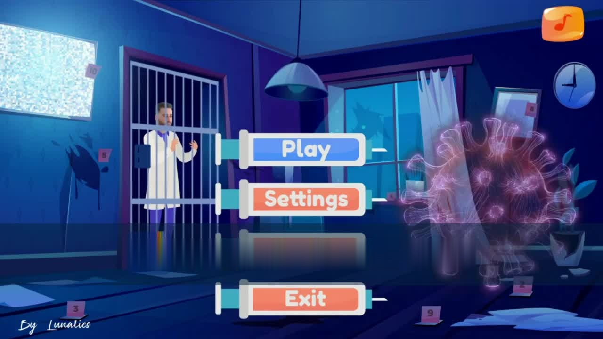
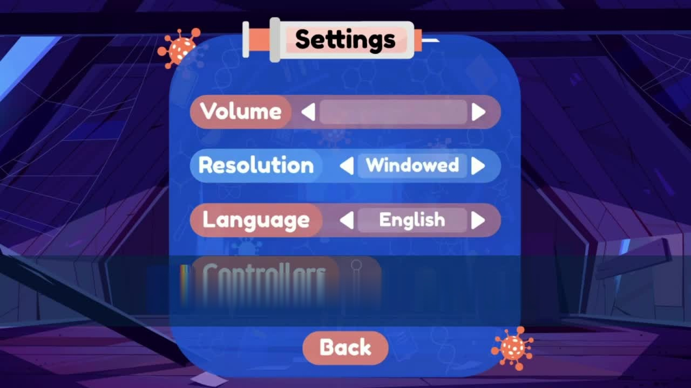
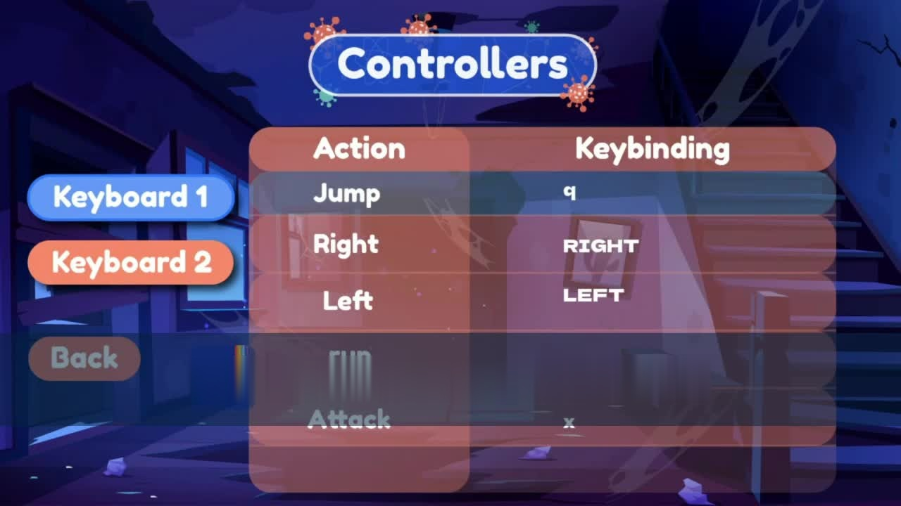
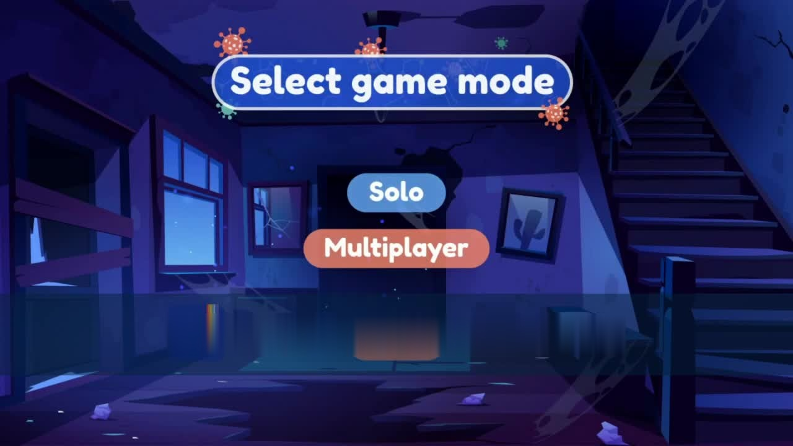

# 🎮 Lunatics Game — 2D Game in Pure C with SDL

> A complete 2D game built entirely in **pure C** using the SDL library.  
> Developed as part of the C programming curriculum at **ESPRIT** (École Supérieure Privée d'Ingénierie et de Technologies), Tunisia.

---

## 🖼️ Screenshots

| Main Menu | Gameplay |
|:---------:|:--------:|
|  |  |

| Settings | Controllers | New Game |
|:--------:|:-----------:|:--------:|
|  |  |  |

---

## 📌 About

**Lunatics** is a full-featured 2D game written in **C99** from scratch, without any game engine.  
Every system — rendering, input, audio, animation, file I/O, and UI — is implemented manually using the SDL family of libraries.

This project demonstrates real-world C programming skills: multi-file architecture, manual memory management, event-driven programming, and low-level system design.

---

## 🛠️ Tech Stack

| Layer        | Technology                          |
|-------------|--------------------------------------|
| Language     | C99 (pure C, no C++)                |
| Graphics     | SDL, SDL_image                      |
| Audio        | SDL_mixer                           |
| Fonts / Text | SDL_ttf                             |
| Build        | GCC, Makefile                       |
| Docs         | Doxygen                             |
| Version ctrl | Git                                 |

---

## ✨ Key Features

### 🧠 Architecture
- **Multi-file project**: `main.c`, `menu.c`, `perso.c`, separated headers in `Headers/`, assets in `Assets/`
- **Modular design**: each game system is isolated in its own source file

### 🖱️ Event-Driven Input
- Full **keyboard and mouse** event handling via SDL's event loop
- Button state machine: `normal` → `hover` → `click` with per-frame state tracking

### 🎨 Rendering & Animation
- Procedural background animation: **190 frames** dynamically loaded with `sprintf` + `IMG_Load`
- Sprite-based UI with multi-state buttons (3 images per button)
- Bilingual interface: **English / French** driven by a runtime integer flag
- **Animated player character** with run/idle sprite sheets

### 🔊 Audio System
- Background music loop via `Mix_PlayMusic`
- Sound effects on hover/click via `Mix_PlayChannel`
- Interactive mute/unmute toggle

### 🎮 HUD & Game Systems
- **Health bar** with smooth rendering
- **Score & Timer** display
- **Minimap** in real time
- **Save / Load game** system via file I/O
- **2-player keybinding** configuration screen

### 💾 Memory Management
- **Zero memory leaks**: every `SDL_Surface*` is freed with `SDL_FreeSurface()` at the correct scope
- No global surface state — all resources are stack/heap managed per function

### 📂 File I/O
- Game state saved and loaded via binary files
- Settings (volume, language) persisted in text files via `fopen` / `fscanf` / `fclose`

### 📖 Documentation
- Full **Doxygen** configuration (`Doxyfile`) — auto-generated HTML documentation

---

## 📁 Project Structure

```
Lunatics-Game-C-SDL/
├── main.c              # Entry point, game loop
├── menu.c              # Main menu, settings, quit dialog
├── perso.c             # Player character logic
├── perso.h             # Player struct and function declarations
├── Headers/
│   └── headers.h       # Global includes and shared declarations
├── Assets/
│   ├── graphic/
│   │   ├── MainMenu/   # Button sprites (normal/hover/click states)
│   │   └── menuAnimation/  # 190-frame background animation
│   └── fonts/          # TTF font files
├── Fichier/
│   ├── volume.txt      # Persisted volume setting
│   └── language.txt    # Persisted language setting
├── screenshots/        # Game screenshots for README
└── Doxyfile            # Doxygen configuration
```

---

## ⚙️ Build & Run

### Prerequisites

Install SDL2 and its modules:

```bash
# Ubuntu / Debian
sudo apt-get install libsdl2-dev libsdl2-image-dev libsdl2-mixer-dev libsdl2-ttf-dev

# macOS (Homebrew)
brew install sdl2 sdl2_image sdl2_mixer sdl2_ttf
```

### Compile

```bash
gcc main.c menu.c perso.c \
    -o lunatics \
    -lSDL2 -lSDL2_image -lSDL2_mixer -lSDL2_ttf \
    -Wall -Wextra
```

### Run

```bash
./lunatics
```

### Generate Documentation (optional)

```bash
doxygen Doxyfile
# Open html/index.html in your browser
```

---

## 🎮 Controls

| Key / Action        | Effect                        |
|--------------------|-------------------------------|
| `↑` / `↓`          | Navigate menu items           |
| `Enter`            | Confirm selection             |
| `M`                | Mute music                    |
| `P`                | Resume music                  |
| Mouse hover        | Highlight button              |
| Mouse click        | Trigger action                |
| `Q` / Window close | Quit game                     |

---

## 💡 C Concepts Demonstrated

- Pointers and pointer arithmetic
- Dynamic memory allocation (`malloc`, `free`)
- Struct-based data modeling
- Multi-file compilation and header guards
- File I/O with `FILE*` — text and binary
- Event loop and state machine design
- Array of pointers (sprite states: `SDL_Surface *button[3]`)
- String formatting with `sprintf`

---

## 👩‍💻 Author

**Yosra Meguebli**  
C Expert · AI & Systems Engineer · PhD Candidate in Deep Learning  

[](mailto:yosra.meguebli@yahoo.fr)
[](https://github.com/Yosra-Megbli)

---

## 📄 License

This project was developed for educational purposes at ESPRIT, Tunisia.  
Feel free to explore the code and learn from it.
